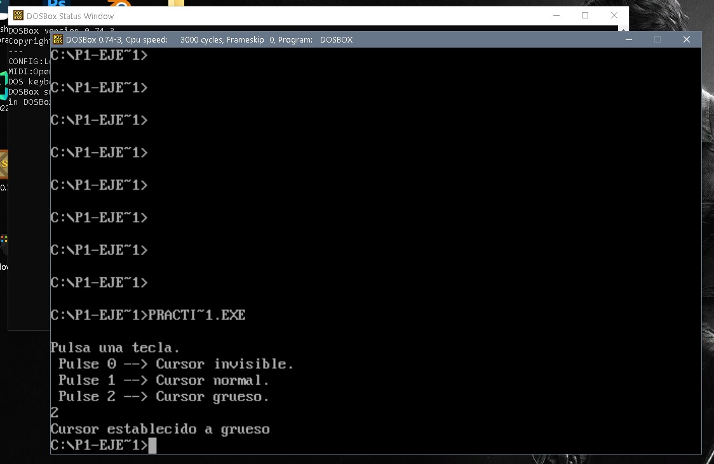
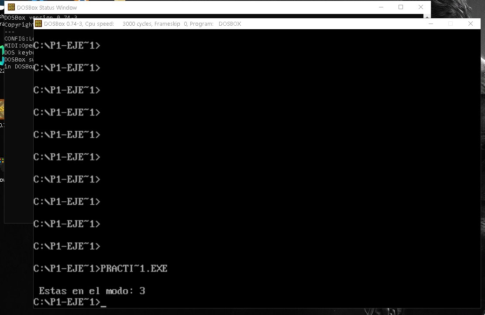
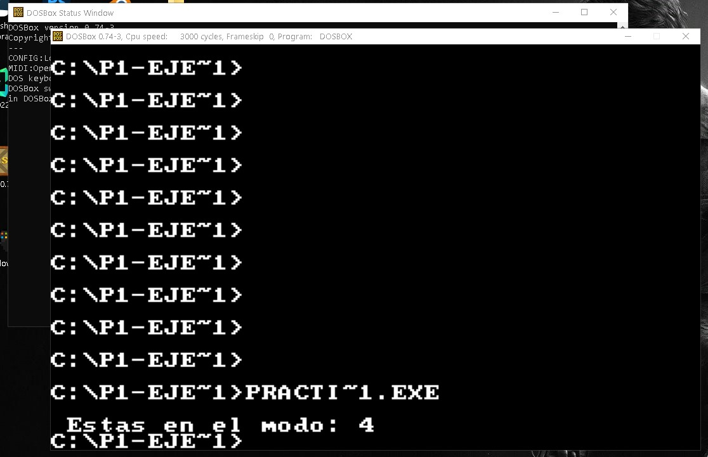
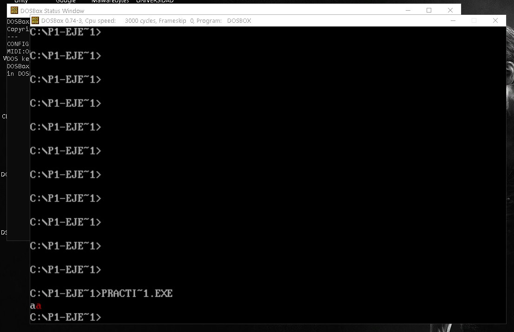
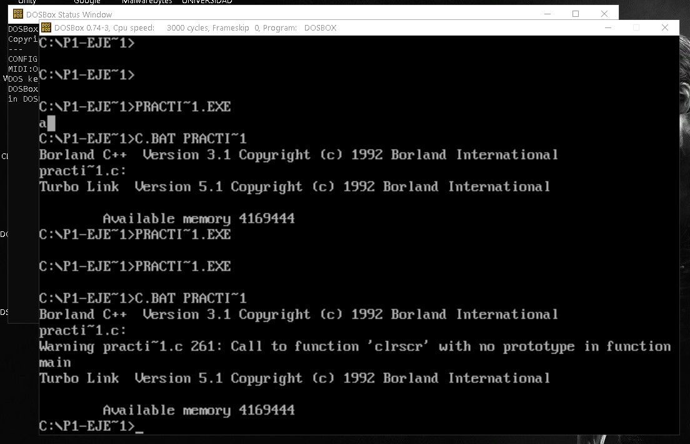
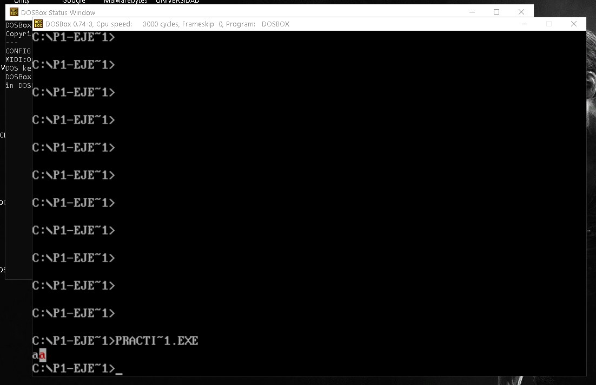
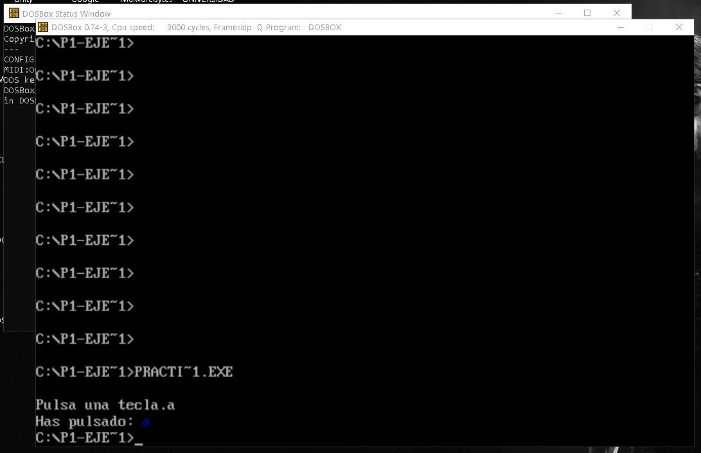

# Práctica 1: Entrada/Salida utilizando interrupciones con lenguaje C

## 1. Objetivos de la práctica

- Aprender la forma de uso y programación de interrupciones software desde programas de usuario.
- Comprender la interfaz que permite un sistema operativo para el acceso a los recursos de entrada/salida.
- Crear una librería de funciones básicas de Entrada/Salida a través de llamadas a interrupciones.

--------------------------

## 2. Introducción

### En esta práctica se va a acceder a las rutinas de servicio a interrupción de la BIOS para teclado y vídeo desde el sistema operativo MS-DOS. . Se va a utilizar el lenguaje de programación C para realizar interrupciones software a través de la función no estándar int86()

--------------------------

## 3. Requisitos Mínimos

### Realizar las siguientes 9 funciones

- ***gotoxy():*** coloca el cursor en una posición determinada.

- ***setcursortype():*** fijar el aspecto del cursor, debe admitir tres valores: INVISIBLE, NORMAL y GRUESO.

- ***setvideomode():*** fija el modo de video deseado.

- ***getvideomode():*** obtiene el modo de video actual.

- ***textcolor():*** modifica el color de primer plano con que se mostrarán los caracteres.

- ***textbackground():*** modifica el color de fondo con que se mostrarán los caracteres.

- ***clrscr():*** borra toda la pantalla.

- ***cputchar():*** escribe un carácter en pantalla con el color indicado actualmente.

- ***getche():*** obtiene un carácter de teclado y lo muestra en pantalla.

--------------------------

## 4. Requisitos Ampliados

- ***Implementar una función que permita dibujar un recuadro en la pantalla en modo texto.*** Recibirá como parámetros las coordenadas superior izquierda e inferior derecha del recuadro, el color de primer plano y el color de fondo.

- Implementar en lenguaje C un programa que establezca modo gráfico CGA (modo=4) ***para crear dibujos sencillos en pantalla***.

--------------------------

## Requisitos Mínimos

### - ***gotoxy():***

### Bien, en esta función lo que se nos pide que hagamos es que posicionemos el cursosr en una posición pasa como parámetro, al cual yo le he puesto x=10 y y=17

```
void gotoxy(int fil, int col){
 union REGS inregs, outregs;

 inregs.h.ah = 2;
 inregs.h.dh = fil;
 inregs.h.dl = col;
 inregs.h.bh = 0;
 int86(0x10, &inregs, &outregs);
}
```

*Resultado:*


--------------------------

### - ***setcursortype():***

### Esta función se encarga de cambiar el tipo de cursor que tenemos, podemos cambiarlo a Invisible, Normal y Grueso.

```
void setcursosrtype(int tipo_cursor){
    
    union REGS inregs, outregs;

    inregs.h.ah = 1;
    switch(tipo_cursor){
        case 0: // invisible
            inregs.h.ch = 010;
            inregs.h.cl = 000;
            break;
        case 1: // por fedecto
            inregs.h.ch = 010;
            inregs.h.cl = 010;
            break;
        case 2: // grueso
            inregs.h.ch = 000;
            inregs.h.cl = 010;
            break;
    }

    int86(0x10, &inregs, &outregs);

}
```

*Resultado:*



--------------------------

### - ***setvideomode():***

### Esta función se encarga de establecer el modo de video deseado, en nuestro caso hemos tomado 2 opciones, la de modo texto y gráfico, sabemos que hay mas variantes dentro de cada opción pero para hacerlo más simple hemos tomado las 2 opciones más importantes.

```
void setvideomode(BYTE modo){

    union REGS inregs, outregs;

    inregs.h.al = modo;
    inregs.h.ah = 0x00;
    int86(0x10, &inregs, &outregs);

}
```
*Resultado:*


--------------------------

### - ***getvideomode():***

### Esta función es lo contrario a la anterior, aqui te muestra en el modo de video en el que estás actualmente.

```
int getvideomode(){

    union REGS inregs, outregs;
    int modo;

    inregs.h.ah = 15;
    int86(0x10, &inregs, &outregs);

    modo = outregs.h.al;

    return modo;

}
```

*Resultado:*





--------------------------

### - ***textcolor():***

### Aqui lo que hacemos es establecer el colo de los caracteres, en este caso le he puesto el color rojo.

```
void textcolor(unsigned char _ctexto){

	ctexto = _ctexto;

}
```

*Resultado:*



--------------------------

### - ***textbackground():***

### En esta función nos encargamos de modificar el color del fondo de los caracteres, en este caso le he puesto un blanco.

```
void textbackground(unsigned char _cfondo){

	cfondo = _cfondo;

}
```

*Resultado:*


--------------------------

### - ***clrscr():***

### Esta función se encarga de borrar toda la pantalla, el truco de esta función es que tenemos una función que sirve para hacer scroll ya sea hacia arriba o hacia abajo, pero ponemos el valor de AH a 0 ésta pasará a borrar la zona delimitada en vez de hacer dicho scroll.

```
void clrscr(){

    union REGS inregs, outregs;

    inregs.h.ah = 0x06;
    inregs.h.al = 0;
    inregs.h.dh = 0x25;
    inregs.h.dl = 0x80;
    inregs.h.bh = 0x00;
    inregs.x.cx = 0x00;
    int86(0x10, &inregs, &outregs);

}
```

*Resultado:*




--------------------------

### - ***cputchar():***

### Esta función escribe un carácter y acto seguido lo muestra con el color que esté actualmente establecido, asique aquí tambien se tienen en cuenta las funciones: textcolor() y textbackground().

```
void cputchar(char letra){

    union REGS inregs, outregs;

    inregs.h.ah = 0x09;
    inregs.h.al = letra;
    inregs.h.bl = cfondo << 4 | ctexto;
    inregs.h.bh = 0x00;
    inregs.x.cx = 1;
    int86(0x10, &inregs, &outregs);
    return;
	
}
```

*Resultado:*



### Como se puede ver, ha escrito el carácter a con el color rojo de letra establecido antes y el color blanco de fondo también establecido antes.

--------------------------

### - ***getche():***

### Por última pero no más importante esta funcion lee una pulsación de teclado y lo muestra por pantalla.

```
int getche(){

    union REGS inregs, outregs;
    int caracter;

    inregs.h.ah = 1;
    int86(0x21, &inregs, &outregs);

    caracter = outregs.h.al;
    return caracter;

}
```

*Resultado:*



### ***ANOTACIÓN:*** *En el .c de la práctica se ha proporcionado el Main con dichas funciones usadas en los ejemplo para poder comprobar su correcto funcionamiento.*