# Práctica 1: Uso de bibliotecas de programación de interfaces de usuario en modo texto.

## 1. Objetivos de la práctica

- instalar la librería ncurses en Linux
- crear programas sencillos basados en ncurses

--------------

## 2. Introducción

### “ncurses” es una biblioteca de programación que provee una API que permite al programador escribir interfaces basadas en texto.

### Podemos usar ncurses en cualquier sistema Unix que siga la norma ANSI/POSIX. Además, puede detectar las propiedades del terminal de la base de datos del sistema y proporcionar una interfaz independiente del terminal.

### Como ncurses no es una librería estándar de C, es necesario indicar al compilador (nosotros usaremos gcc) que la enlace con nuestro programa.

### ncurses crea una capa sobre las capacidades del terminal y proporciona un marco de trabajo robusto para crear interfaces de usuario en modo texto. Permite crear fácilmente aplicaciones basadas en ventanas, menús, paneles y formularios. Además, las ventanas se pueden gestionar de forma independiente, facilitando su movimiento, e incluso se pueden ocultar/mostrar.

-----------------------

## 3. Requisitos Mínimos

1.  ***Instalar la librería ncurses***, crear los programas de ejemplo ofrecidos más 
arriba, y comprobar su funcionamiento. 
2. ***Crear un juego sencillo tipo “pong”*** partiendo del ejemplo del movimiento de la 
pelotita.

-------------------------

## 4. Requisitos Ampliados

1. Al iniciar el juego se muestre una ***pantalla de bienvenida*** en la que se 
muestren los datos de quienes han realizado el juego y explicando los 
controles de juego (p.ej. un recuadro con la explicación). Tras una pausa o 
pulsación de tecla se iniciará el juego en sí mismo.
2. Al terminar cada partida se muestre una ***pantalla de resumen*** mostrando el 
marcador final y felicitando al ganador. Se dará la opción de volver a jugar o 
terminar el programa.

--------------------------

## Requisitos Mínimos

### Para poder usar la librería ncurses es necesaria instalarla, para ello tenemos que abrir la terminal que tengamos y poner el siguiente comando:

* **sudo apt-get install libncurses5-dev libncursesw5-dev**

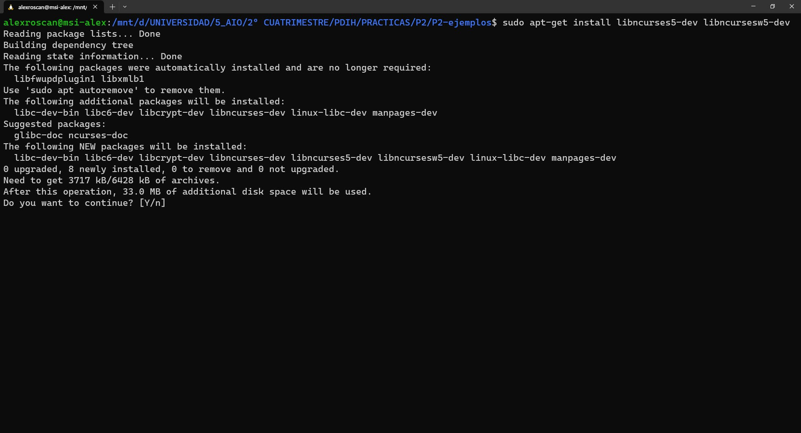
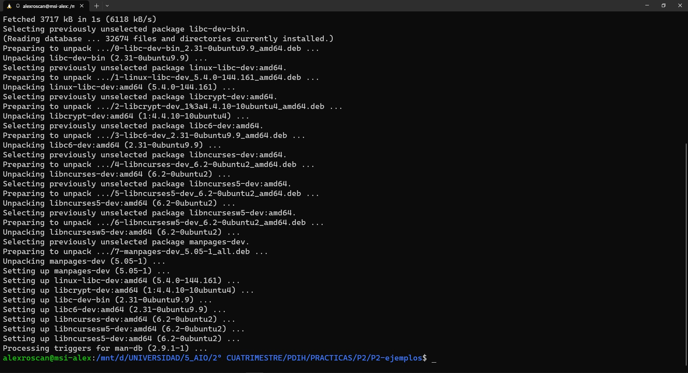

### Tras ello ya podremos usar la librería ncurses.

### Acto seguido procedemos a crear 2 ejemplos, uno que nos servirá para mostrar una ventana en la terminal y otro será para mostrar una pelotita en movimiento en la terminal, ambos codigos estan en el gión.

<br>

***Mostrar ventana***
```
// 
// gcc Ejer1.c -o Ejer1 -lncurses
// 

#include <stdlib.h>
#include <ncurses.h>

int main(){

    int filas, columnas;

    initscr();

    if(has_colors() == FALSE){

        endwin();
        printf("El terminal no tiene soporte de color\n");
        exit(1);

    }

    start_color();

    init_pair(1,COLOR_YELLOW, COLOR_GREEN);
    init_pair(2, COLOR_BLACK, COLOR_WHITE);
    init_pair(3, COLOR_WHITE, COLOR_BLUE);
    clear();

    refresh();
    getmaxyx(stdscr, filas, columnas);

    WINDOW *window = newwin(filas,columnas,0,0);
    wbkgd(window, COLOR_PAIR(3));
    box(window, '|', '-');

    mvwprintw(window, 10, 10, "una cadena");
    wrefresh(window);

    getch();
    endwin();

    return 0;
}
```

### A modo de resumen en el programa hacemos una comprobación de si el terminal soporta colores, en caso contrario informará de ello y se cerrará, en caso contrario seguira y creará los colores que se podran usar para la ventana, después refrescamos la pantalla y obtenemos el tamaño de la ventana. Con esos datos podemos crear la ventana, establecer su color y crear un marco, tras eso se muestra el mensaje, se actualiza la ventana para mostrar todo lo nuevo y se restaura la terminal para dejar de hacer uso de nuestro programa.

<br>

***Resultado:***

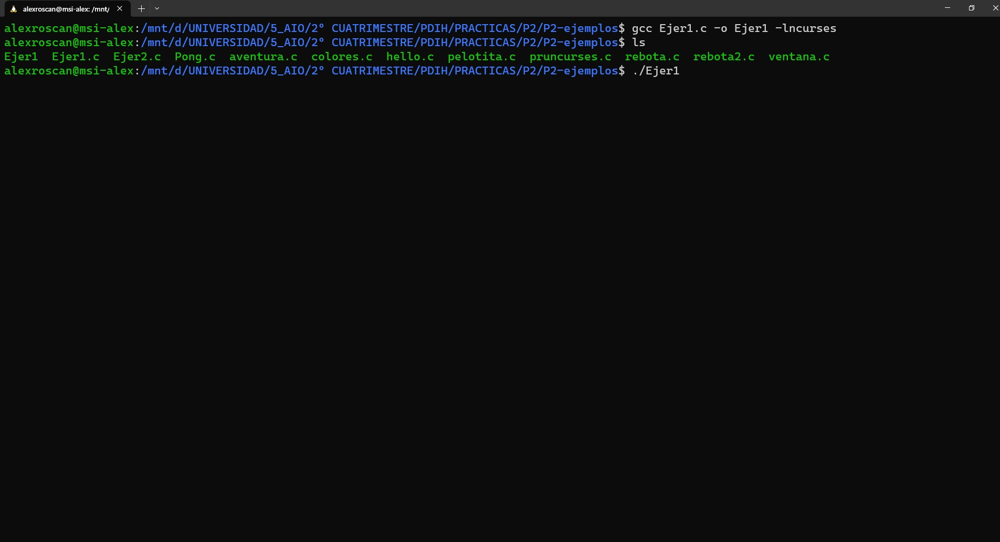
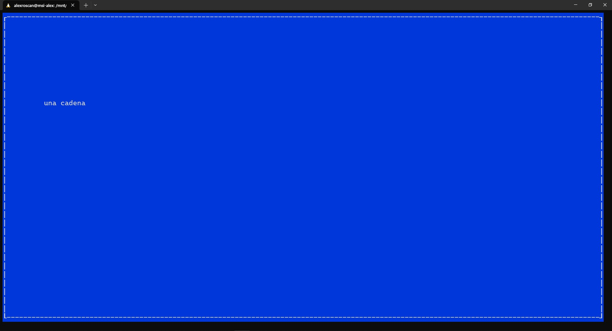

<br>

***Mover pelotita***
```
// 
// gcc Ejer2.c -o Ejer2 -lncurses
// 

#include <ncurses.h>
#include <unistd.h>

#define DELAY 30000

int main(int argc, char *argv[]){

    int x = 0, y = 0;
    int max_y = 50, max_x = 50;
    int next_x = 0;
    int direction = 1;

    initscr();
    noecho();
    curs_set(FALSE);

    while(1){

        clear();
        mvprintw(y, x, "o");
        refresh();

        usleep(DELAY);

        next_x = x + direction;

        if(next_x >= max_x || next_x < 0){

            direction *= -1;

        }else{

            x += direction;
        }
    }

    endwin();
}
```

### En el programa básicamente se crean los valores de la posición de la pelota, los valores para la ventana y dirección de la pelota. Crea un bucle en el que constanntemente va a estar mostrando la pelota en distintas posiciones, también se le indica a la pelota que si llega a los límites establecidos de su pantalla, esta rebote para cambiar de dirección.

<br>

***Resultado:***

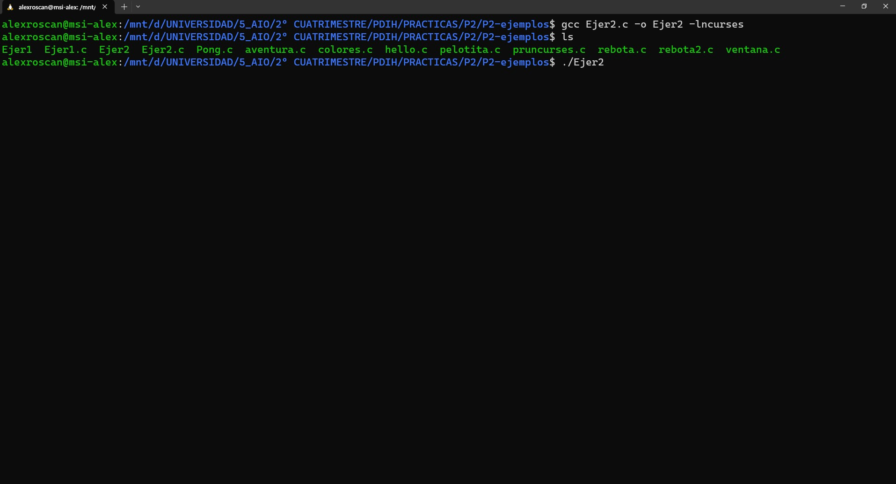
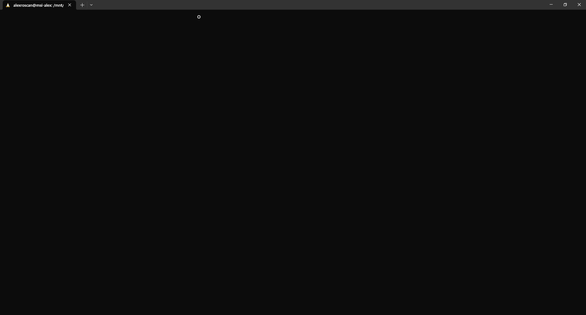

-----------------
### Bien, ahora pasemos a lo importante de la práctica, que es la creación del juego del "Pong". Antes que nada quiero indicar que el juego completo con las mejoras se llama Pong.c pero para el ejercicio de requisito mínimo que se pide del Pong lo he llamado Pong2.c para mostrar el código y dicho funcionamiento.

<br>

### Para hacer el programa nos podemos ayudar del código del archivo rebota2.c que nos proporciona el profesor en el cual nos viene prácticamente gran parte del cósdigo implementado ya que tiene hecho el rebote de la pelota en toda la pantalla.

<br>

### Ya comentado eso, procedo a explicar las modificaciones que he hecho.

<br>

***Pong2.c***

```
// 
// gcc Pong2.c -o Pong2 -lncurses
// 

#include <stdlib.h>
#include <ncurses.h>
#include <stdlib.h>

#define DELAY 55000

int main(int argc, char *argv[]){

 int filas, columnas;

    initscr();

    if (has_colors() == FALSE) {
    	endwin();
    	printf("Your terminal does not support color\n");
    	exit(1);
	}

    start_color();
    init_pair(1, COLOR_WHITE, COLOR_BLACK);
    clear();

    refresh();
    getmaxyx(stdscr, filas, columnas);

    // JUEGO

    // Rango de espacio de la pelota
    int max_y = filas, max_x = columnas;    

    // Posicion inicial de la pelota
    int next_x = max_x/2;
    int next_y = max_y/2;
    int x = max_x/2, y = max_y/2;
    
    // Dirección de la pelota
    int directionx = 1, directiony = 1;

    // Jugador 1 Posición
    int J1_xc = 0, J1_yc = max_y/2;
    
    // Jugador 2 Posición
    int J2_xc = max_x - 1, J2_yc = max_y/2;

    //Puntuación de los jugadores
    int J1_Puntos = 0;
    int J2_Puntos = 0;

    initscr();
    noecho();
    cbreak();
    curs_set(FALSE);
    nodelay(stdscr, TRUE);
    
    while(1) {

        clear();

        // Pintamos el marcador con los puntos de ambos jugadores
        mvprintw(0, max_x/2 - 16, "%d :J1_Puntos | J2_Puntos: %d", J1_Puntos, J2_Puntos);

        // Pintamos opciones de salir y pausar
        mvprintw(max_y - 1, max_x/2 , "Q --> SALIR");
        mvprintw(max_y - 1, max_x/2 - 17, "P --> PAUSAR");

        // Pintamos la linea divisoria
        for(int i = 1; i < 37; i++){
            mvprintw(i, max_x/2 - 3, "|");
        }

        // Pintamos la pelota
        mvprintw(y, x, "o");

        // Pintamos al J1
        mvprintw(J1_yc, J1_xc, "|");

        // Pintamos al J2
        mvprintw(J2_yc, J2_xc, "|");

        // Lectura de pulsaciones
        switch(getch()){
            case 'w': J1_yc--; break;   // Si es W el J1 se mueve hacia arriba
            case 's': J1_yc++; break;   // Si es S el J1 se mueve hacia abajo
            case 'i': J2_yc--; break;   // Si es I el J2 se mueve hacia arriba
            case 'k': J2_yc++; break;   // Si es K el J2 se mueve hacia abajo
            case 'q': endwin(); exit(1); break; // Si es Q se sale del juego
            case 'p': getchar(); break; // Si es P se pausa el juego
        }

        usleep(DELAY);

        refresh();

        // Direccion de la pelota
        next_x = x + directionx;
        next_y = y + directiony;

        // Calculo del movimiento de la pelota en el eje X
        if (next_x == J2_xc && (next_y <= J2_yc && next_y >= J2_yc)) {
            directionx*= -1;
        } 
        else if(next_x == J1_xc && (next_y <= J1_yc && next_y >= J1_yc)) {
            directionx*= -1;
        }else{
            x += directionx;
        }

        // Calculo del movimiento de la pelota en el eje Y
        if (next_y >= max_y || next_y < 0) {
            directiony*= -1;
        } 
        else {
            y+= directiony;
        }

        // Calcular los puntos
        if(next_x > J2_xc){

            // Establecemos la posicion de la pelota a la inicial
            next_x = max_x/2;
            next_y = max_y/2;
            x = max_x/2, 
            y = max_y/2;

            // J1 suma 1 punto
            J1_Puntos++;

        }else if(next_x < J1_xc){

            // Establecemos la posicion de la pelota a la inicial
            next_x = max_x/2;
            next_y = max_y/2;
            x = max_x/2, 
            y = max_y/2;

            // J2 suma 1 punto
            J2_Puntos++;

        }
    }
}
```

### Bueno, partiendo de que tenemos el codigo de ayuda, las modificaciones que he hecho son varias.

1. He añadido al J1 y al J2, con sus respectivas posiciones y también las variables para saber el puntaje de cada jugador.
```
// Jugador 1 Posición
    int J1_xc = 0, J1_yc = max_y/2;
    
    // Jugador 2 Posición
    int J2_xc = max_x - 1, J2_yc = max_y/2;

    //Puntuación de los jugadores
    int J1_Puntos = 0;
    int J2_Puntos = 0;
```
2. Pintar a ambos jugadores, poelota, marcador de los puntos y las opciones de pausa y salir del juego.
```
// Pintamos el marcador con los puntos de ambos jugadores
        mvprintw(0, max_x/2 - 16, "%d :J1_Puntos | J2_Puntos: %d", J1_Puntos, J2_Puntos);

        // Pintamos opciones de salir y pausar
        mvprintw(max_y - 1, max_x/2 , "Q --> SALIR");
        mvprintw(max_y - 1, max_x/2 - 17, "P --> PAUSAR");

        // Pintamos la linea divisoria
        for(int i = 1; i < 37; i++){
            mvprintw(i, max_x/2 - 3, "|");
        }

        // Pintamos la pelota
        mvprintw(y, x, "o");

        // Pintamos al J1
        mvprintw(J1_yc, J1_xc, "|");

        // Pintamos al J2
        mvprintw(J2_yc, J2_xc, "|");
```
3. En cuanto al tema de reconocimiento de pulsaciones de tecla, he hecho lo siguiente:
```
// Lectura de pulsaciones
        switch(getch()){
            case 'w': J1_yc--; break;   // Si es W el J1 se mueve hacia arriba
            case 's': J1_yc++; break;   // Si es S el J1 se mueve hacia abajo
            case 'i': J2_yc--; break;   // Si es I el J2 se mueve hacia arriba
            case 'k': J2_yc++; break;   // Si es K el J2 se mueve hacia abajo
            case 'q': endwin(); exit(1); break; // Si es Q se sale del juego
            case 'p': getchar(); break; // Si es P se pausa el juego
        }
```
### Para el J1 se le asignan las teclas W y S para subir y bajar, al J2 las teclas I y K para subir y bajar, la Q para salir del juego y la P para pausar.
3. Para poder delimitar el espacio en el que se mueve la pelota en la pantalla y que detecte a los jugadores hay que modificar el movimiento en el eje x.
```
// Calculo del movimiento de la pelota en el eje X
        if (next_x == J2_xc && (next_y <= J2_yc && next_y >= J2_yc)) {
            directionx*= -1;
        } 
        else if(next_x == J1_xc && (next_y <= J1_yc && next_y >= J1_yc)) {
            directionx*= -1;
        }else{
            x += directionx;
        }
```
### Cuando rebota en la parte de arriba o abajo de la pantalla y ademas colisiona en la misma posición que la del jugador la pelota rebotará.
4. Por último hacemos el cálculo de puntos.
```
// Calcular los puntos
        if(next_x > J2_xc){

            // Establecemos la posicion de la pelota a la inicial
            next_x = max_x/2;
            next_y = max_y/2;
            x = max_x/2, 
            y = max_y/2;

            // J1 suma 1 punto
            J1_Puntos++;

        }else if(next_x < J1_xc){

            // Establecemos la posicion de la pelota a la inicial
            next_x = max_x/2;
            next_y = max_y/2;
            x = max_x/2, 
            y = max_y/2;

            // J2 suma 1 punto
            J2_Puntos++;

        }
```

### Si la posición de la pelota es superior al límite de la parte izquierda o derecha de la pantalla, reinicia la posición de la pelota a la inicial y sumará un punto al rival contrario.

<br>

***Resultado:***

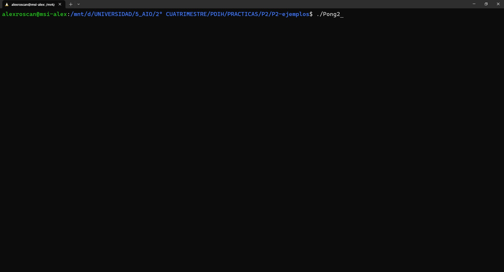
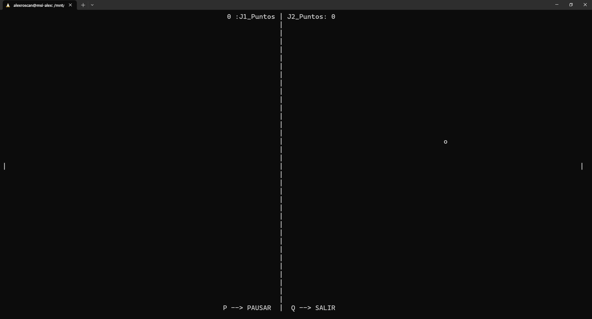
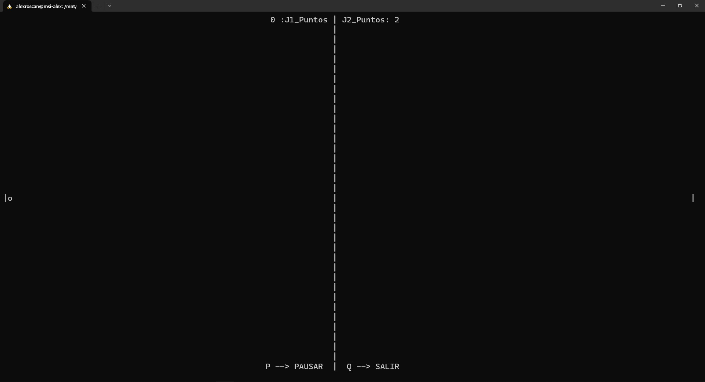

------------------------------------

## Requisitos Ampliados

### En esta parte se pide modificar el juego para que al inicio te muestre una pantalla de bienvenida indicando quien ha creado el juego y con una breve explicación de los controles, tras la pulsación de una tecla se daría paso directamente al juego y al terminar se mostrará una pantalla final en la cual muestre el marcador final, quien ha ganado y las opciones de salir o volver a jugar.

<br>

***Pong2.c***
```
// 
// gcc Pong.c -o Pong -lncurses
// 

#include <stdlib.h>
#include <ncurses.h>
#include <stdlib.h>

#define DELAY 55000

#define GOAL 5

int main(int argc, char *argv[]){

    int filas, columnas;

    initscr();

    if (has_colors() == FALSE) {
    	endwin();
    	printf("Your terminal does not support color\n");
    	exit(1);
	}

    start_color();
    init_pair(1, COLOR_WHITE, COLOR_BLACK);
    clear();

    refresh();
    getmaxyx(stdscr, filas, columnas);

    // PANTALLA INICIO

    WINDOW *window = newwin(filas, columnas, 0, 0);

    wbkgd(window, COLOR_PAIR(1));
    box(window, '|', '-');

    mvwprintw(window, 12, 55, "BIENVENIDO AL JUEGO DEL PONG!!!");
    mvwprintw(window, 14, 47, "Juego realizado por: Alejandro Rosales Cantero");
    mvwprintw(window, 15, 52, "Jugador 1: W --> Arriba, S --> Abajo");
    mvwprintw(window, 16, 52, "Jugador 2: I --> Arriba, K --> Abajo");
    mvwprintw(window, 17, 57, "Gana el que llegue a 5 puntos");
    mvwprintw(window, 18, 48, "Pulsa cualquier tecla para empezar a jugar");
    wrefresh(window);
    getch();

    werase(window);

    // JUEGO

    // Rango de espacio de la pelota
    int max_y = filas, max_x = columnas;    

    // Posicion inicial de la pelota
    int next_x = max_x/2;
    int next_y = max_y/2;
    int x = max_x/2, y = max_y/2;
    
    // Dirección de la pelota
    int directionx = 1, directiony = 1;

    // Jugador 1 Posición
    int J1_xc = 0, J1_yc = max_y/2;
    
    // Jugador 2 Posición
    int J2_xc = max_x - 1, J2_yc = max_y/2;

    //Puntuación de los jugadores
    int J1_Puntos = 0;
    int J2_Puntos = 0;

    initscr();
    noecho();
    cbreak();
    curs_set(FALSE);
    nodelay(stdscr, TRUE);
    
    while(1) {

        clear();

        // Pintamos el marcador con los puntos de ambos jugadores
        mvprintw(0, max_x/2 - 16, "%d :J1_Puntos | J2_Puntos: %d", J1_Puntos, J2_Puntos);

        // Pintamos opciones de salir y pausar
        mvprintw(max_y - 1, max_x/2 , "Q --> SALIR");
        mvprintw(max_y - 1, max_x/2 - 17, "P --> PAUSAR");

        // Pintamos la linea divisoria
        for(int i = 1; i < 37; i++){
            mvprintw(i, max_x/2 - 3, "|");
        }

        // Pintamos la pelota
        mvprintw(y, x, "o");

        // Pintamos al J1
        mvprintw(J1_yc, J1_xc, "|");

        // Pintamos al J2
        mvprintw(J2_yc, J2_xc, "|");

        // Lectura de pulsaciones
        switch(getch()){
            case 'w': J1_yc--; break;   // Si es W el J1 se mueve hacia arriba
            case 's': J1_yc++; break;   // Si es S el J1 se mueve hacia abajo
            case 'i': J2_yc--; break;   // Si es I el J2 se mueve hacia arriba
            case 'k': J2_yc++; break;   // Si es K el J2 se mueve hacia abajo
            case 'q': endwin(); exit(1); break; // Si es Q se sale del juego
            case 'p': getchar(); break; // Si es P se pausa el juego
        }

        usleep(DELAY);

        refresh();

        // Direccion de la pelota
        next_x = x + directionx;
        next_y = y + directiony;

        // Calculo del movimiento de la pelota en el eje X
        if (next_x == J2_xc && (next_y <= J2_yc && next_y >= J2_yc)) {
            directionx*= -1;
        } 
        else if(next_x == J1_xc && (next_y <= J1_yc && next_y >= J1_yc)) {
            directionx*= -1;
        }else{
            x += directionx;
        }

        // Calculo del movimiento de la pelota en el eje Y
        if (next_y >= max_y || next_y < 0) {
            directiony*= -1;
        } 
        else {
            y+= directiony;
        }

        // Calcular los puntos
        if(next_x > J2_xc){

            // Establecemos la posicion de la pelota a la inicial
            next_x = max_x/2;
            next_y = max_y/2;
            x = max_x/2, 
            y = max_y/2;

            // J1 suma 1 punto
            J1_Puntos++;

        }else if(next_x < J1_xc){

            // Establecemos la posicion de la pelota a la inicial
            next_x = max_x/2;
            next_y = max_y/2;
            x = max_x/2, 
            y = max_y/2;

            // J2 suma 1 punto
            J2_Puntos++;

        }

        // Si alguno de los 2 jugadores llega al máximo de puntuación termina el juego 
        // y nos muestra la pantalla de Game Over
        if( J1_Puntos == GOAL || J2_Puntos == GOAL){

            clear();

            mvprintw(12, 66, "¡GAME OVER!");
            mvprintw(14, 48, "JUGADOR 1: %d PUNTO/S  ---  JUGADOR 2: %d PUNTO/S", J1_Puntos, J2_Puntos);
            mvprintw(17, 47, "Presiona 'R' para volver a jugar o 'Q' para salir.");

            // Si gana el J1 le felicita a él sino será al J2
            if(J1_Puntos > J2_Puntos){
                mvprintw(15, 60, "¡FELICIDADES JUGADOR 1!");
            }
            else{
               mvprintw(15, 60, "¡FELICIDADES JUGADOR 2!");
            }

            wrefresh(window);

            while(1){

                // Leemos una pulsación de tecla
                int c = getch();    

                // Si es R significa que queremos repetir asique inicializamos las posiciones 
                // de las palas y la bola a la posicion inicial y los puntos a 0 de ambos jugadores
                if(c == 'r'){   

                    // Reiniciamos los puntos 
                    J1_Puntos = 0;
                    J2_Puntos = 0;

                    // Establecemos la posicion de la pelota a la inicial
                    next_x = max_x/2;
                    next_y = max_y/2;
                    x = max_x/2, 
                    y = max_y/2;

                    // Establecemos la posicion del Jugador 1 a la inicial
                    J1_xc = 0;
                    J1_yc = max_y/2;

                    // Establecemos la posicion del Jugador 2 a la inicial
                    J2_xc = max_x - 1;
                    J2_yc = max_y/2;

                    break;
                }
                else if (c == 'q' ){    // Si pulsamos Q es queremos salir

                    endwin();
                    return 0;

                }
            }
        }
    } 
}
```
<br>

1. ***Pantalla de inicio o bienvenida***: En esta parte es hacer una ventana como se nos explica en el Ejercicio 1 de los requisitos mínimos.

```
// PANTALLA INICIO

    WINDOW *window = newwin(filas, columnas, 0, 0);

    wbkgd(window, COLOR_PAIR(1));
    box(window, '|', '-');

    mvwprintw(window, 12, 55, "BIENVENIDO AL JUEGO DEL PONG!!!");
    mvwprintw(window, 14, 47, "Juego realizado por: Alejandro Rosales Cantero");
    mvwprintw(window, 15, 52, "Jugador 1: W --> Arriba, S --> Abajo");
    mvwprintw(window, 16, 52, "Jugador 2: I --> Arriba, K --> Abajo");
    mvwprintw(window, 17, 57, "Gana el que llegue a 5 puntos");
    mvwprintw(window, 18, 48, "Pulsa cualquier tecla para empezar a jugar");
    wrefresh(window);
    getch();

    werase(window);
```

2. ***Pantalla final***: En esta parte he tenido un poco de más problema pero al final se ha conseguido sacar.

```
  // Si alguno de los 2 jugadores llega al máximo de puntuación termina el juego 
        // y nos muestra la pantalla de Game Over
        if( J1_Puntos == GOAL || J2_Puntos == GOAL){

            clear();

            mvprintw(12, 66, "¡GAME OVER!");
            mvprintw(14, 48, "JUGADOR 1: %d PUNTO/S  ---  JUGADOR 2: %d PUNTO/S", J1_Puntos, J2_Puntos);
            mvprintw(17, 47, "Presiona 'R' para volver a jugar o 'Q' para salir.");

            // Si gana el J1 le felicita a él sino será al J2
            if(J1_Puntos > J2_Puntos){
                mvprintw(15, 60, "¡FELICIDADES JUGADOR 1!");
            }
            else{
               mvprintw(15, 60, "¡FELICIDADES JUGADOR 2!");
            }

            wrefresh(window);

            while(1){

                // Leemos una pulsación de tecla
                int c = getch();    

                // Si es R significa que queremos repetir asique inicializamos las posiciones 
                // de las palas y la bola a la posicion inicial y los puntos a 0 de ambos jugadores
                if(c == 'r'){   

                    // Reiniciamos los puntos 
                    J1_Puntos = 0;
                    J2_Puntos = 0;

                    // Establecemos la posicion de la pelota a la inicial
                    next_x = max_x/2;
                    next_y = max_y/2;
                    x = max_x/2, 
                    y = max_y/2;

                    // Establecemos la posicion del Jugador 1 a la inicial
                    J1_xc = 0;
                    J1_yc = max_y/2;

                    // Establecemos la posicion del Jugador 2 a la inicial
                    J2_xc = max_x - 1;
                    J2_yc = max_y/2;

                    break;
                }
                else if (c == 'q' ){    // Si pulsamos Q es queremos salir

                    endwin();
                    return 0;

                }
            }
        }
```

### Yo en un principio quería crear una pantalla nueva en el momento en el que uno de los 2 jugadores llegase al GOAL establecido como victoria, pero no me funcionaba entonces decidí hacer un borrado de la pantalla propia del juego. Acto seguido saco por pantalla el marcador final y dependiendo de quien haya ganado mostrara un mensaje felicitando al J1 o al J2, también esta el añadido de las opciones de salir o repetir partida, si se pulsa Q se termina el juego y se sale, en caso de pulsar R se restablecerá todo a 0 y a sus posiciones iniciales y volverá a empezar el juego, así hasta que se decida salir desde el propio juego o en la pantalla final.

<br>

***Resultado:***

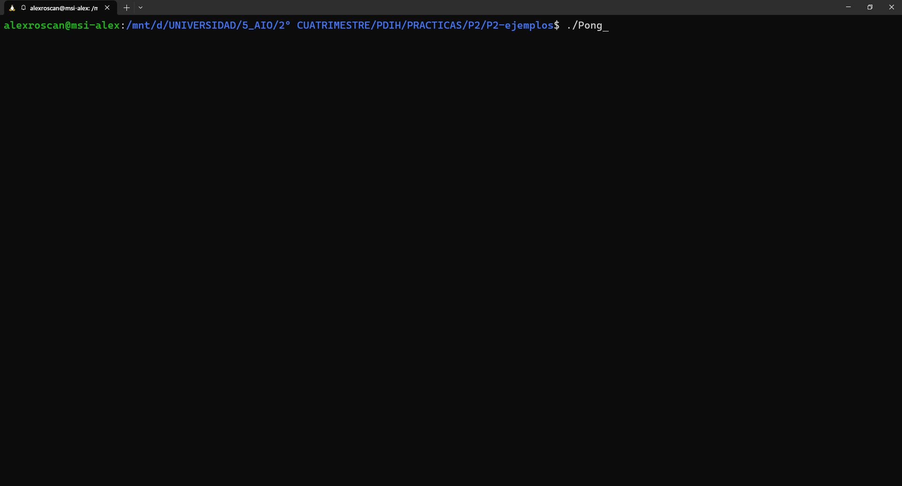
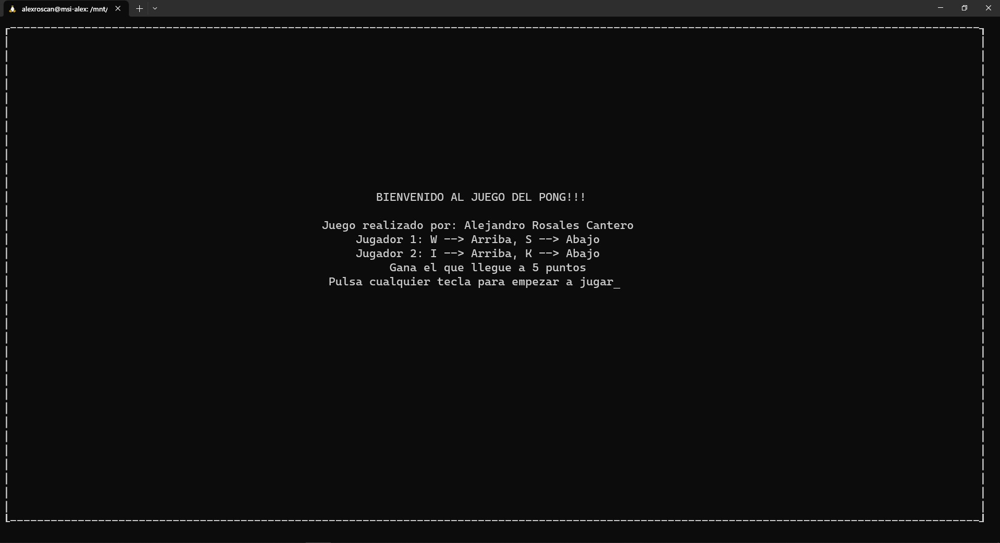

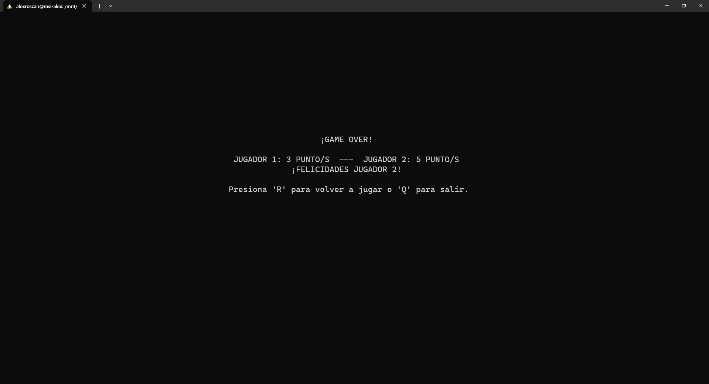
