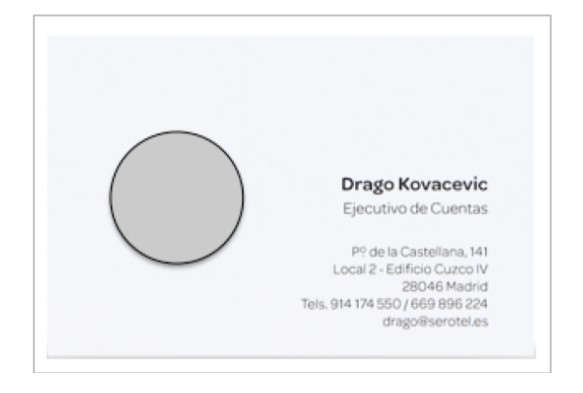
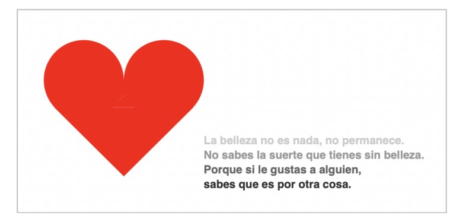
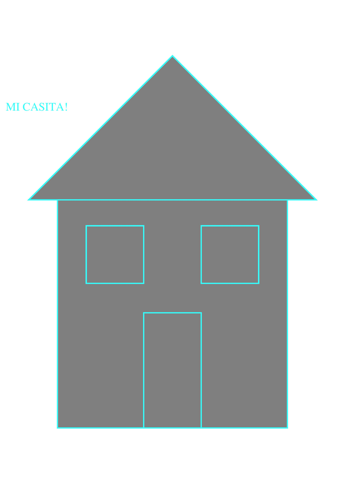
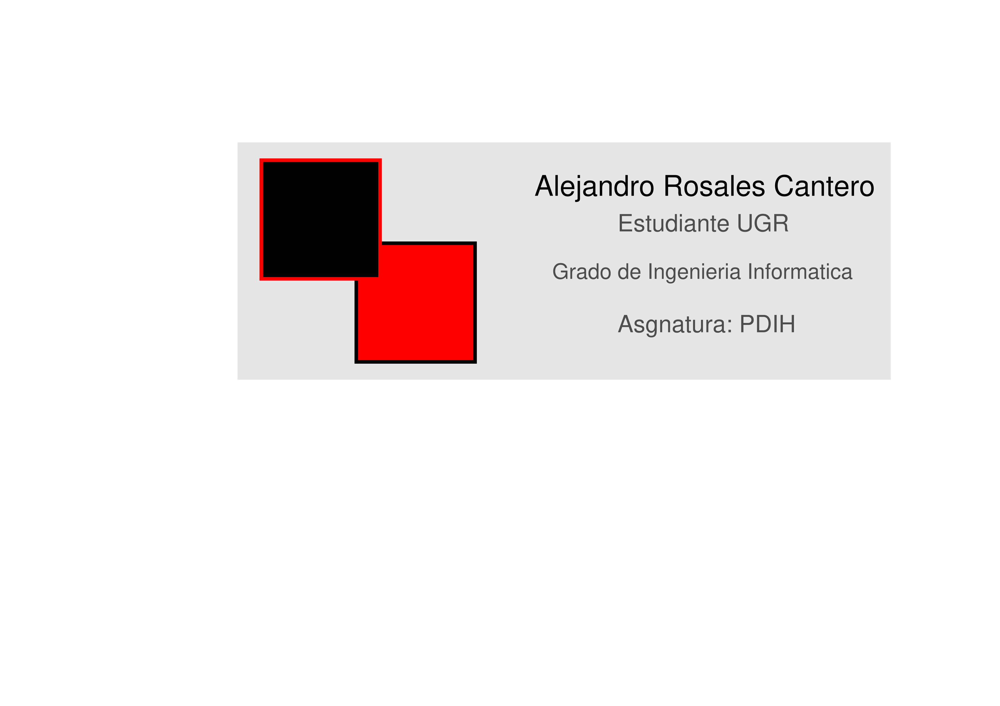

# Práctica 4: El lenguaje Postscript

## 1. Objetivos de la práctica

* Conocer la sintaxis básica del lenguaje Postscript.
* Crear varios archivos y probar el funcionamiento con un visor Postscript.
* Transformar los ejemplos creados a otros formatos de archivo, como PDF.

--------------

## 2. Introducción

### El lenguaje PostScript (PS) es el código de programación que se usa para especificarle a una impresora qué y cómo debe imprimir, paso a paso. 

### PS es un lenguaje de descripción de página (LDP), y un documento PS es un pequeño programa que le dice a una máquina qué, cómo y dónde imprimir: cualquier documento PS que imprimamos (p.ej. PDF o EPS) se interpreta en el procesador interno de la impresora. 

### PS es un lenguaje interpretado, de forma que se necesita un procesador o intérprete (un dispositivo físico o un programa en el ordenador) entre el código PS y la impresora física.

-----------------------

## 3. Requisitos Mínimos

1. **Página en la que se muestre el dibujo 
de una casita, similar al siguiente:**


2. **Página en la que diseñes una tarjeta de visita, similar a la siguiente:**



-----------------------

## 4. Requisitos Ampliados

3. **Realizar una página con 
el siguiente diseño: el dibujo de un corazón y un texto en varios tonos de gris, similar a la siguiente:**



--------------------------

## Requisitos Mínimos

### El primer ejercicio consiste en hacer el dibujo de una casita con un texto que diga mi casita. Bien, yo lo que he hecho es primero hacer la casa sólo con las figuras rellenas de color gris y luego a cada parte le he ido añadiendo la misma figura pero vacía por dentro y con la línea exterior nad más para asi crearle un borde a las figuras. 

### Para el texto simplemente lo he añadido con los comandos que tenemos y cambiado el color.

***- Código:***

```
%!PS

newpath			% Start a new path

100 499 moveto
400  0 rlineto
0 -400 rlineto
-400  0 rlineto

0.5 0.5 0.5 setrgbcolor

fill

closepath

5 setlinewidth

stroke

newpath			% Start a new path

100 499 moveto
400  0 rlineto
0 -400 rlineto
-400  0 rlineto

0.2 1 1 setrgbcolor

closepath

2 setlinewidth

stroke

newpath			% Start a new path

50 495 moveto
500  0 rlineto
-250 250  rlineto

0.5 0.5 0.5 setrgbcolor

fill

closepath

5 setlinewidth

stroke

newpath			% Start a new path

50 495 moveto
500  0 rlineto
-250 250  rlineto
%%150  0 rlineto

0.2 1 1 setrgbcolor

closepath

2 setlinewidth

stroke

newpath			% Start a new path

250 99 moveto
100  0 rlineto
0 200 rlineto
-100  0 rlineto

0.5 0.5 0.5 setrgbcolor

fill

closepath

5 setlinewidth

stroke

newpath			% Start a new path

250 99 moveto
100  0 rlineto
0 200 rlineto
-100  0 rlineto

0.2 1 1 setrgbcolor

closepath

2 setlinewidth

stroke

newpath			% Start a new path

150 350 moveto
100  0 rlineto
0 100 rlineto
-100  0 rlineto

0.5 0.5 0.5 setrgbcolor

fill

closepath

5 setlinewidth

stroke

newpath			% Start a new path

150 350 moveto
100  0 rlineto
0 100 rlineto
-100  0 rlineto

0.2 1 1 setrgbcolor

closepath

2 setlinewidth

stroke

newpath			% Start a new path

350 350 moveto
100  0 rlineto
0 100 rlineto
-100  0 rlineto

0.5 0.5 0.5 setrgbcolor

closepath

5 setlinewidth

fill

stroke

newpath			% Start a new path

350 350 moveto
100  0 rlineto
0 100 rlineto
-100  0 rlineto

0.2 1 1 setrgbcolor

closepath

2 setlinewidth

stroke

/Times-Roman findfont
20 scalefont
setfont

newpath
10 650 moveto
(MI CASITA!) show
stroke

showpage
```

***- Resultado:***



-----------------

### El segundo ejercicio consiste en hacer una tarjeta de presentación a nuestra libre elección, yo he decidido hacer una tarjeta de presentación de estudiante la cual la he puesto en una hoja horizontal con un logotipo personalizado y un texto con mi nombre, donde estudio, qué estudio y la asignatura en la que estoy.

### Aquí en este caso he hecho un logo que son dos cuadrados que se unen por una esquina haciendo una combinación de colores de relleno y de borde, a su derecha esta el texto con los datos y de fondo hay un recuadro relleno de un color de tono oscuro para hacer notar una diferencia de colores notoria y que parezca una tarjeta de presentación.

***- Código:***

```
%!PS

<< /PageSize [842 595] >> setpagedevice

newpath			% Start a new path

200 275 moveto
550  0 rlineto
0 200 rlineto
-550  0 rlineto

0.9 0.9 0.9 setrgbcolor

fill 

closepath

3 setlinewidth

stroke

newpath			% Start a new path

300 290 moveto
100  0 rlineto
0 100 rlineto
-100  0 rlineto

1 0 0 setrgbcolor

fill 

closepath

3 setlinewidth

stroke

newpath			% Start a new path

300 290 moveto
100  0 rlineto
0 100 rlineto
-100  0 rlineto

0 0 0 setrgbcolor

closepath

3 setlinewidth

stroke

newpath			% Start a new path

220 360 moveto
100  0 rlineto
0 100 rlineto
-100  0 rlineto

0 0 0 setrgbcolor

fill 

closepath

3 setlinewidth

stroke

newpath			% Start a new path

220 360 moveto
100  0 rlineto
0 100 rlineto
-100  0 rlineto

1 0 0 setrgbcolor

closepath

3 setlinewidth

stroke

/Arial findfont
24 scalefont
setfont

newpath
0.0 setgray
450 430 moveto
(Alejandro Rosales Cantero) show
stroke

closepath

/Arial findfont
20 scalefont
setfont

newpath
0.3 setgray
520 400 moveto
(Estudiante UGR) show
stroke

closepath

/Arial findfont
18 scalefont
setfont

newpath
0.3 setgray
465 360 moveto
(Grado de Ingenieria Informatica) show
stroke

closepath

/Arial findfont
20 scalefont
setfont

newpath
0.3 setgray
520 315 moveto
(Asgnatura: PDIH) show
stroke

closepath

showpage
```

***- Resultado:***



----------------------------

Requisitos Ampliado

### Éste ejercicio consiste en replicar una página con un corazón y un texto que tiene varias líneas y cada línea va cambiando de color, pasando del blanco hasta el negro pasando por sus distintas tonalidades.

### Yo lo he hecho en una página horizontal y el corazón lo he hecho es usar 2 semicirculos que van desde el grado 0 al 180 para hacer la parte de arriba y abajo le he unido un triángulo posicionado hacia abajo, para el texto pues cada linea con su código correspondiente y su cambio de color.

***- Código:***

```
%!PS

<< /PageSize [842 595] >> setpagedevice

newpath			% Start a new path

1 0 0 setrgbcolor
0.1 setlinewidth
% x  y   R  angI angF
 140 419.8  55   0   180   arc
1 0 0 setrgbcolor
fill

closepath
stroke

newpath			% Start a new path

1 0 0 setrgbcolor
0.1 setlinewidth
% x  y   R  angI angF
 230 419.8  55   0   180   arc
1 0 0 setrgbcolor
fill

closepath
stroke

newpath			% Start a new path

85 420 moveto
200  0 rlineto
-103 -150 rlineto

1 0 0 setrgbcolor

fill

closepath

5 setlinewidth

stroke

closepath
stroke

/Arial findfont
13 scalefont
setfont

newpath
0.7 setgray
350 300 moveto
(La belleza no es nada, no permanece.) show
stroke

closepath

/Arial findfont
13 scalefont
setfont

newpath
0.5 setgray
350 280 moveto
(No sabes la suerte que tienes sin belleza.) show
stroke

closepath

/Arial findfont
13 scalefont
setfont

newpath
0.3 setgray
350 260 moveto
(Porque si le gustas a alguien,) show
stroke

closepath

/Arial findfont
13 scalefont
setfont

newpath
0.1 setgray
350 240 moveto
(Sabes que es por otra cosa.) show
stroke

closepath

showpage
```

***- Resultado:***


