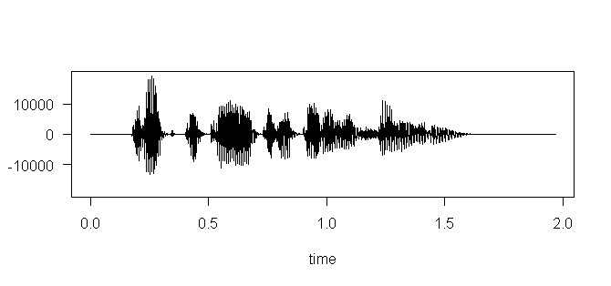
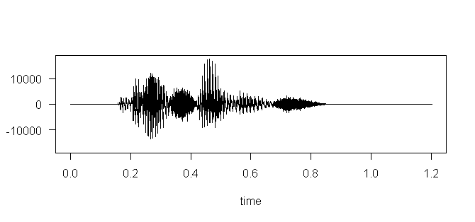
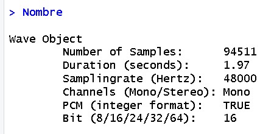
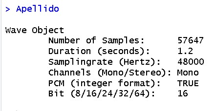
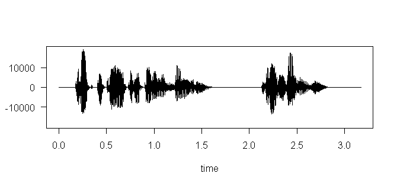

# Práctica 5: Experimentación con el sistema de salida de sonido

## 1. Objetivos de la práctica

* Identificar y representar gráficamente la forma de onda de señales de sonido.
* Conocer la estructura de un fichero típico de sonido (ficheros WAV).
*  Entender y operar con los parámetros principales de una señal de sonido.

--------------

## 2. Introducción

### El formato WAV o WAVE (“onda”), diseñado por Microsoft, es uno de los formatos de sonido más sencillos que existen. Consta básicamente de tres partes o bloques: el fichero comienza con un bloque de identificación, a continuación sigue un bloque que especifica los parámetros del formato y, por último, finaliza con el bloque que contiene las muestras.

### En R disponemos de varias librerías que nos permitirán trabajar con archivos de sonido, tanto WAV como MP3. Las más conocidas y aquellas para las que más documentación podemos encontrar son tuneR, seewave y soundgen. En este seminario (y la práctica correspondiente) usaremos las dos primeras.

### Una vez instalado RStudio, pasaremos a instalar ambas librerías:

```
install.packages('tuneR', dep=TRUE)
install.packages('seewave', dep=TRUE)
install.packages('soundgen', dep=TRUE)
```

### Creamos un archivo nuevo y justo al principio del mísmo cargamos las librerías:

```
library(tuneR)
library(seewave)
library(soundgen)
library(audio)
```

-------------------

## 3. Ejercicios

1. **Leer dos ficheros de sonido (WAV o MP3) de unos pocos segundos de duración cada uno. En el primero debe escucharse el nombre de la persona que realiza la práctica. En el segundo debe escucharse el apellido.**

```
Nombre <- readWave('Alejandro.wav')
Apellido <- readWave('Rosales.wav')
```

2. **Dibujar la forma de onda de ambos sonidos.**

```
round(length(Nombre@left) / Nombre@samp.rate, 6)
plot(extractWave(Nombre, from = 1, to = 1968979))
```


```
round(length(Apellido@left) / Apellido@samp.rate, 6)
plot(extractWave(Apellido, from = 1, to = 1200979))
```


3. **Obtener la información de las cabeceras de ambos sonidos.**

```
Nombre
```



```
Apellido
```



4. **Unir ambos sonidos en uno nuevo.**

```
NombreCompleto <- pastew(Apellido, Nombre, output = "Wave")
```

5. **Dibujar la forma de onda de la señal resultante.**

```
round(length(NombreCompleto@left) / NombreCompleto@samp.rate, 6)
plot(extractWave(NombreCompleto, from = 1, to = 3169958))
```



6. **Pasarle un filtro de frecuencia para eliminar las frecuencias entre 10000Hz y 20000Hz**

```
Filtro6 <- bwfilter(NombreCompleto, 48000, channel = 1, from =  10000,
                    to = 20000, bandpass = TRUE, listen = FALSE, output = "Wave")
```

7. **Almacenar la señal obtenida como un fichero WAV denominado “mezcla.wav”.**

```
writeWave(Filtro6, file.path("mezcla.wav"))
```

8. **Cargar un nuevo archivo de sonido, aplicarle eco y a continuación darle la vuelta al sonido. Almacenar la señal obtenida como un fichero WAV denominado “alreves.wav”.**

```
mezcla <- readWave('mezcla.wav')

# mezcla con eco

str(mezcla)
mezclaEco <- echo(mezcla, f=22050, amp=c(0.8,0.4,0.2), delay=c(1,2,3), 
                  output="Wave")

mezclaEco@left <- 10000 * mezclaEco@left

# mezcla con eco al reves

alreves <- revw(mezclaEco, output="Wave")

# lo guardamos

writeWave(alreves, file.path("alreves.wav"))
```
