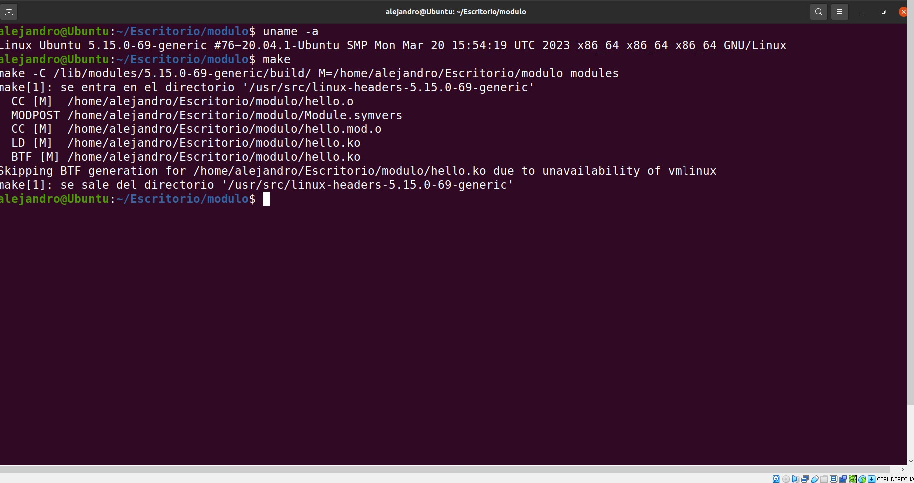
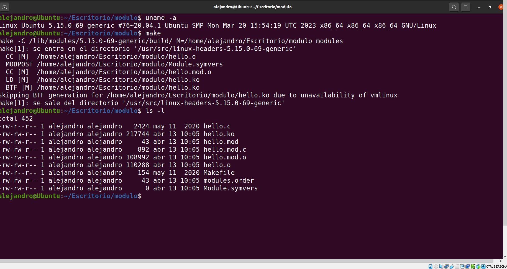
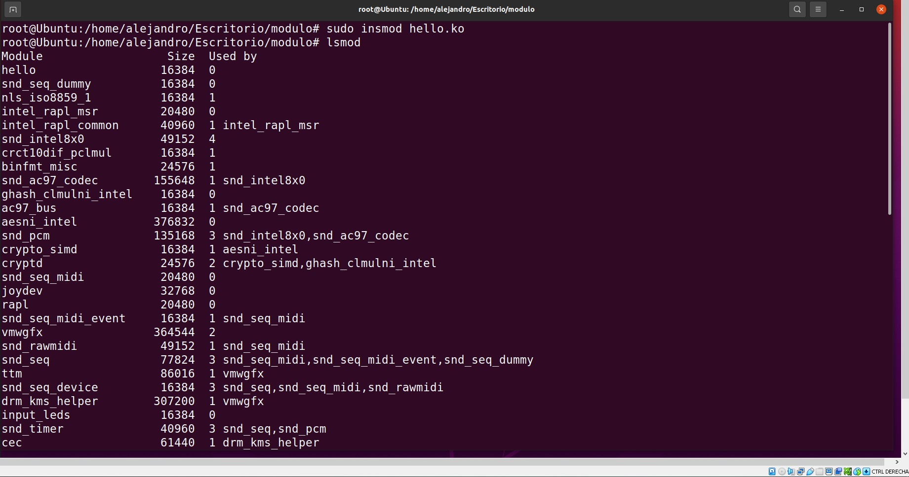
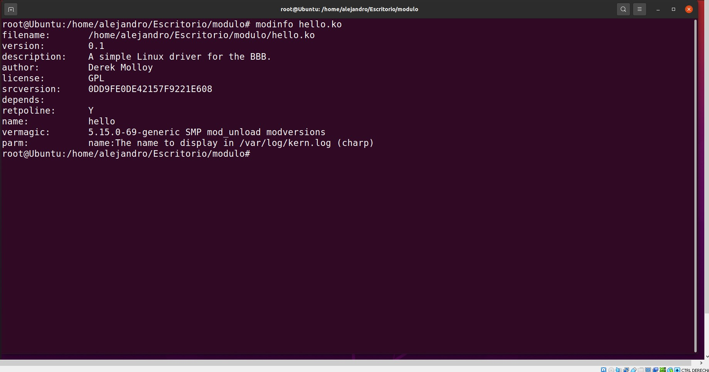
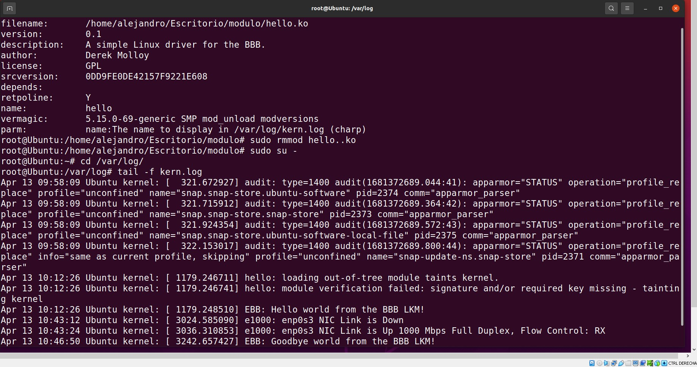

# SEMINARIO 4 - MÓDULOS CARGABLES DEL KERMEL (LKM):
### Los objetivos concretos de este seminario son:
* Aprender cómo funcionan los módulos cargables del kernel (LKM).
* Configurar nuestro sistema para construir, cargar y descargar dichos módulos.
* Comprobar el funcionamiento de un módulo LKM sencillo.

----------------------
## **1. Itroducción:**

### En computación, un “módulo cargable del núcleo” (loadable kernel module, LKM) es un archivo que contiene código objeto que puede extender el kernel en ejecución de un sistema operativo. La mayoría de los sistemas operativos modernos soportan módulos cargables en el kernel, habitualmente llamados "módulos cargables" o "extensión del núcleo". Un ejemplo típico de módulo cargable son los controladores de dispositivo.
### Los módulos cargables en el kernel son generalmente utilizados para brindar soporte a nuevos dispositivos de hardware (periféricos) y sistemas de archivos, así como para agregar llamadas al sistema, extendiéndolo. Cuando la funcionalidad provista por un módulo del kernel deja de ser requerida, normalmente éste puede ser descargado, liberando su memoria.
### En este seminario queremos escribir un módulo del kernel de Linux muy sencillo que podría dar servicio a un dispositivo (periférico o sistema de archivos en general). 
### Adicionalmente, un ejemplo avanzado que se sale del ámbito de este seminario podría ser el desarrollo de controladores de dispositivos de caracteres y la creación deaplicaciones en el espacio de usuario que se comuniquen con estos módulos LKM.

------------------

## **2. ¿Qué es un módulo kermel?:**

### Un LKM es un mecanismo para añadir código al kernel de Linux, o eliminarlo, en tiempo de ejecución. Es una técnica ideal para dar soporte a nuevos dispositivosperiféricos y sistemas de archivos, ya que permiten que el kernel se comunique con el hardware sin tener que saber cómo funciona éste. Vienen a ser lo que habitualmente conocemos como software de controlador del dispositivo. La alternativa a los LKMssería incluir el código para todos los posibles controladores de dispositivos en el núcleo de Linux, lo que daría lugar a un núcleo extremadamente complejo e inmanejable.
### Sin esta capacidad modular, el kernel de Linux sería muy grande, ya que tendría que soportar todos los controladores que se pudieran llegar a necesitar. También habría que reconstruir el núcleo cada vez que se quisiera añadir nuevo hardware o actualizar un controlador de dispositivo.
### Los LKM se cargan en tiempo de ejecución, pero no se ejecutan en el espacio de usuario, ya que son esencialmente parte del kernel. Ese código se ejecuta en el espacio del kernel, mientras que las aplicaciones se ejecutan en el espacio de usuario. 
### Tanto el espacio del kernel como el del usuario tienen sus propios espacios de direcciones de memoria que no se pueden solapar.
### Este enfoque garantiza que las aplicaciones que se ejecutan en el espacio de usuariotengan una visión coherente del hardware, independientemente de las características físicas de los diferentes periféricos que podamos tener. Así, los servicios del kernel se ponen a disposición del espacio de usuario de forma controlada usando llamadas al sistema.
### Es conveniente usar módulos del kernel porque así la interacción con dispositivos periféricos se realiza mediante una interfaz homogénea siempre (usando sysfs) yoperaciones de archivo sencillas tipo apertura, lectura, escritura y cierre.

----------------------------

## **3. Ejemplo de LKM:**

### Usaremos como código de ejemplo el facilitado por “derekmolloy” en su repositorio: 

### https://github.com/derekmolloy/exploringBB/tree/master/extras/kernel/

### El siguiente listado proporciona el código de un primer ejemplo de LKM muy sencillo. El código utiliza la función printk() para mostrar "¡Hola mundo!..." en los registros de log del kernel:

```
/**
 * @file    hello.c
 * @author  Derek Molloy
 * @date    4 April 2015
 * @version 0.1
 * @brief  An introductory "Hello World!" loadable kernel module (LKM) that can display a message
 * in the /var/log/kern.log file when the module is loaded and removed. The module can accept an
 * argument when it is loaded -- the name, which appears in the kernel log files.
 * @see http://www.derekmolloy.ie/ for a full description and follow-up descriptions.
*/

#include <linux/init.h>             // Macros used to mark up functions e.g., __init __exit
#include <linux/module.h>           // Core header for loading LKMs into the kernel
#include <linux/kernel.h>           // Contains types, macros, functions for the kernel

MODULE_LICENSE("GPL");              ///< The license type -- this affects runtime behavior
MODULE_AUTHOR("Derek Molloy");      ///< The author -- visible when you use modinfo
MODULE_DESCRIPTION("A simple Linux driver for the BBB.");  ///< The description -- see modinfo
MODULE_VERSION("0.1");              ///< The version of the module

static char *name = "world";        ///< An example LKM argument -- default value is "world"
module_param(name, charp, S_IRUGO); ///< Param desc. charp = char ptr, S_IRUGO can be read/not changed
MODULE_PARM_DESC(name, "The name to display in /var/log/kern.log");  ///< parameter description

/** @brief The LKM initialization function
 *  The static keyword restricts the visibility of the function to within this C file. The __init
 *  macro means that for a built-in driver (not a LKM) the function is only used at initialization
 *  time and that it can be discarded and its memory freed up after that point.
 *  @return returns 0 if successful
 */
static int __init helloBBB_init(void){
   printk(KERN_INFO "EBB: Hello %s from the BBB LKM!\n", name);
   return 0;
}

/** @brief The LKM cleanup function
 *  Similar to the initialization function, it is static. The __exit macro notifies that if this
 *  code is used for a built-in driver (not a LKM) that this function is not required.
 */
static void __exit helloBBB_exit(void){
   printk(KERN_INFO "EBB: Goodbye %s from the BBB LKM!\n", name);
}

/** @brief A module must use the module_init() module_exit() macros from linux/init.h, which
 *  identify the initialization function at insertion time and the cleanup function (as
 *  listed above)
 */
module_init(helloBBB_init);
module_exit(helloBBB_exit);
```

### Para compilar el módulo usaremos un Makefile, haciendo el proceso de compilación muy sencillo:

```
obj-m+=hello.o
all:
    make -C /lib/modules/$(shell uname -r)/build/ M=$(PWD) modules
clean:
    make -C /lib/modules/$(shell uname -r)/build/ M=$(PWD) 
clean
```
### Como resultado, obtendrá un LKM llamado hello.ko en el directorio de trabajo (el archivo con extensión .ko):




### Este módulo puede ser cargado ahora usando las herramientas del módulo del kernel como se muestra en las siguientes capturas. Primero veamos cómo insertar el nuevo módulo en el kernel (insmod):



### A continuación solicitaremos información sobre el módulo (modinfo):



### Finalmente, lo eliminamos del kernel (rmmod) y revisaremos la salida de la función printk() en el registro de log del kernel:

