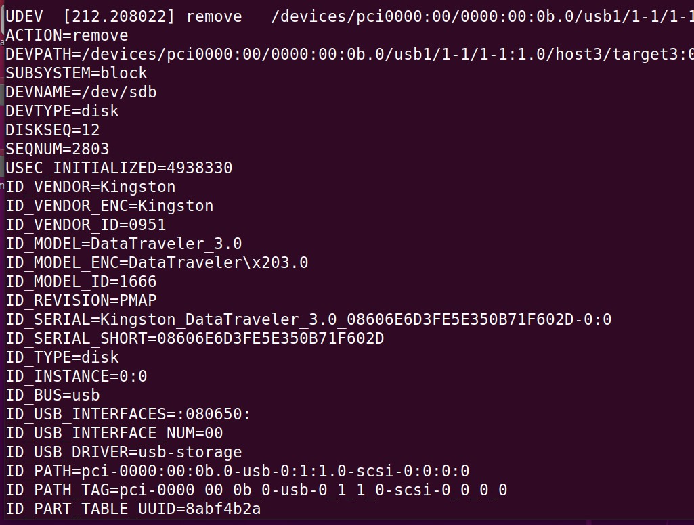
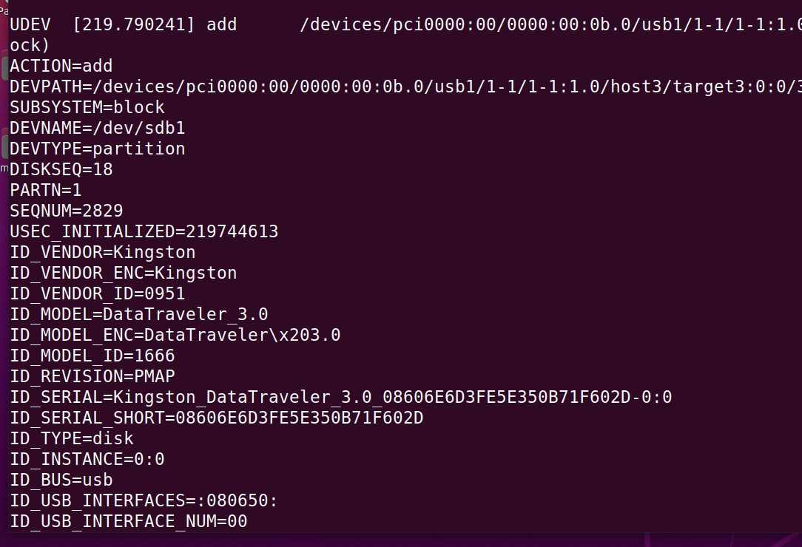
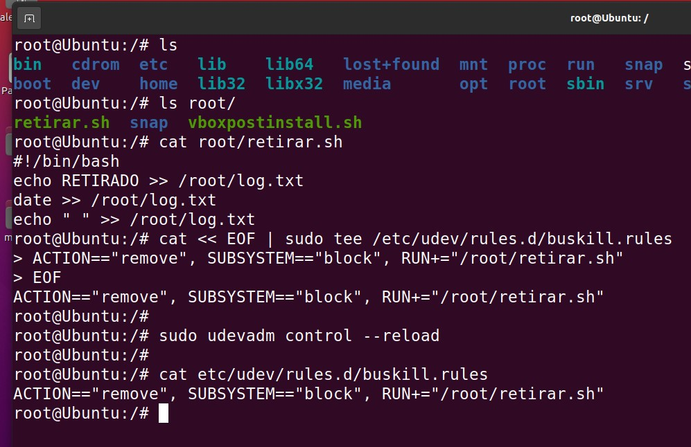
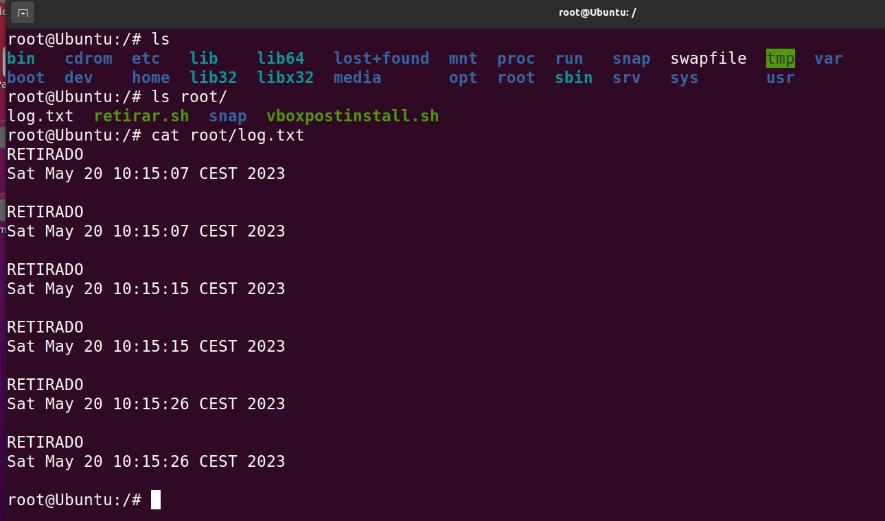
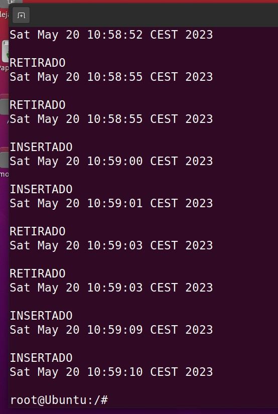

# Seminario: Gestor de dispositivos udev de Linux

## 1. Objetivos del seminario:

* Conocer cómo funciona el gestor de dispositivos udev de Linux.
* Configurar una regla sencilla para detectar la conexión o desconexión de un dispositivo USB en el sistema.

-------------------

## 2. Introducción:

### udev es un gestor de dispositivos genérico que se ejecuta como un demonio en un sistema Linux y escucha (a través de un socket netlink) los eventos que el kernel envía si se inicializa un nuevo dispositivo o se elimina un dispositivo del sistema. Este gestor de dispositivos se ejecuta en el espacio de usuario.

### Las reglas de udev se leen de los archivos ubicados en el directorio de reglas del sistema /lib/udev/rules.d

### cuando se agrega o quita un dispositivo (o cambia su estado de alguna forma) el kernel lo informa al servicio systemd-udevd. Este último puede configurarse para responder a dichos eventos mediante reglas en archivos con la extensión .rules

### Por otro lado, la herramienta udevadm controla el funcionamiento de udev. Entre otros usos, destaca la monitorización de los eventos detectados por el kernel.

---------------------------------

## 3. Crear una regla **udev**:

### Queremos crear una configuración en nuestra máquina de forma que al retirar un dispositivo USB del ordenador se lance una "acción udev".

### Para configurarlo vamos a añadir una nueva regla al archivo de reglas udev, localizado en /etc/udev/rules.d/

### La idea es crear una regla sencilla que ejecute un proceso (p.ej. lanzar el salvapantallas para bloquear la pantalla) cada vez que se retire cualquier dispositivo USB de uno de los puertos. Debemos tener siempre en cuenta que el proceso que se ejecute lo hará con privilegios de root.

### Pero antes de comenzar con la configuración, veamos qué ocurre en el kernel cuando conectamos o desconectamos un dispositivo. Para ello ejecutamos el siguiente comando y vemos qué mensajes muestra el kernel ante cada tipo de evento:

***udevadm monitor --environment --udev***




### Podemos ver diversa información sobre los dispositivos conectados/desconectados en ese momento. Además, en cada evento vemos que se aporta información sobre la acción, sobre el subsistema afectado, el tipo de dispositivo o el nombre del dispositivo:

+ ACTION=unbind
+ ACTION=remove
+ ACTION=add
+ SUBSYSTEM=usb
+ SUBSYSTEM=block
+ DEVTYPE=disk
+ DEVTYPE=usb_device
+ DEVNAME=/dev/sdd

### Así pues, usando esta información podemos crear una regla que añadiremos a las que hay en el sistema de reglas para que se ejecute cuando se produzca uno de esos eventos.

### Para el primer ejemplo sencillo (y comprobar así que todo funciona bien) vamos a crear un script llamado "retirar.sh" que simplemente añada un par de líneas a un archivo de texto llamado "log.txt". Ese script lo guardaremos en la carpeta /root/ 

```
#!/bin/bash
echo RETIRADO >> /root/log.txt
date >> /root/log.txt
echo " " >> /root/log.txt
```

### Una vez tenemos el proceso que será lanzado cuando se desconecte un dispositivo USB, sólo tenemos que crear un archivo con extensión .rules en el directorio /etc/udev/rules.d detallando el evento que queremos comprobar y especificando la acción que queremos realizar. Para ello podemos ejecutar lo siguiente:

```
cat << EOF | sudo tee /etc/udev/rules.d/busKill.rules
ACTION=="remove", SUBSYSTEM=="block", RUN+="/root/retirar.sh"
EOF
```

### En ese ejemplo hemos pedido que ante un evento de tipo "remove" relacionado con el subsistema block se ejecute el script que hemos creado antes.

***sudo udevadm control --reload***



***-RESULTADO:***



---------------------------------------

## 4. Mejorando la regla **udev**:

### En éste caso yo he hecho la mejora de que detecte cuando se conecta y se desconecta.

### Supongamos que queremos detectar, no solo la desconexión de un dispositivo, sino también cuándo se conecta al sistema. En este caso necesitaríamos dos scripts y crear las correspondientes reglas en el archivo .rules:

```
/root/insertar.sh
/root/retirar.sh
```

***Insertar.sh***
```
#!/bin/bash
echo INSERTADO >> /root/log.txt
date >> /root/log.txt
echo " " >> /root/log.txt
```

### A continuación, creamos dos reglas para activar la ejecución de esos scripts:

```
sudo nano /etc/udev/rules.d/busKill.rules

ACTION=="add", SUBSYSTEM=="block", RUN+="/root/insertar.sh" 
ACTION=="remove", SUBSYSTEM=="block", RUN+="/root/retirar.sh" 
```

***-RESULTADO:***


