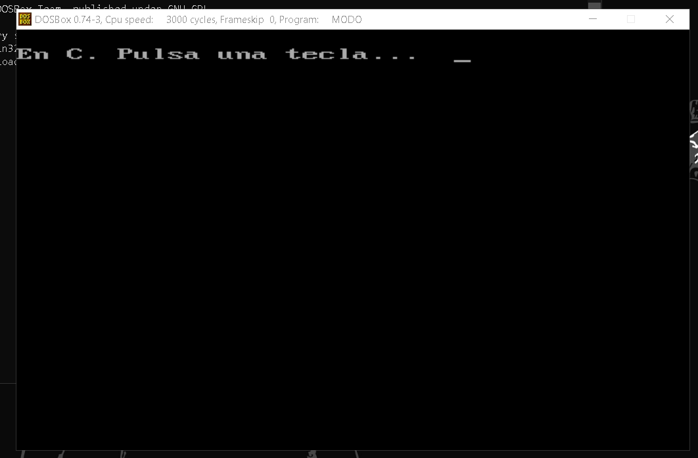
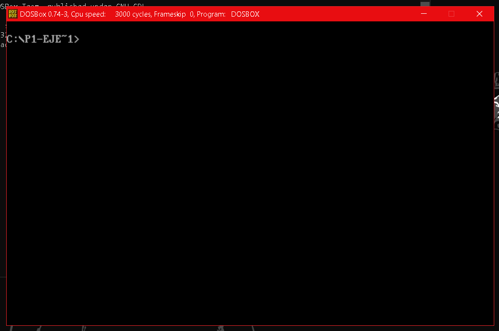
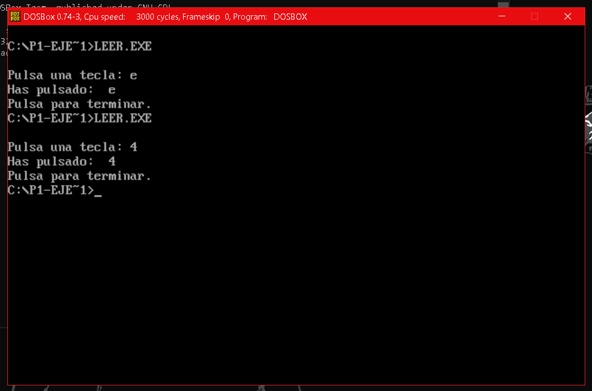

# SEMINARIO 2 - EJERCICIOS:
### En seminario se nos pide que hagamos 2 ejercicios, los cuales son:
1. Realizar un programa en lenguaje C que llame a la función de **cambio de modo de video** y comprobar su funcionamiento. 
2. Realizar otro programa en lenguaje C que que llame a la función de interrupción correspondiente a la **lectura de caracteres desde teclado**. Ejecutarlo para leer las pulsaciones de teclado y **mostrarlas por pantalla** usando otra función de interrupción.
---------------
## EJERCICIO 1: Cambio de modo de video.
### Este ejercicio viene explicado un poco más arriba en el guión asique es cuestión de copiar el código y probar, también nos podemos ayudar de los ejemplo aportados por el profesor porque hay uno que hace l que se pide. 
***modo.c***

```
#include <stdio.h>
#include <dos.h>

void mi_pausa(){

   union REGS inregs, outregs;

	 inregs.h.ah = 8;
	 int86(0x21, &inregs, &outregs);

}

void modo(unsigned char modo){

	union REGS inregs, outregs; 

	inregs.h.ah = 0x00; 
	inregs.h.al = modo; 
	int86(0x10,&inregs,&outregs); 

	return;
	
}

int main(){

	mi_modo_video(1);  // modo 1 -> 40x25 (letras grandes)

	printf("\nEn C. Pulsa una tecla...  ");

   	mi_pausa();

	modo(3);  // modo 3 -> 80x25 (letras pequeñas)

	return 0;
}
```
### Como podemos observar el código se basa en 2 funciones y 1 main en el cual llamaremos a dichas funciones.
 - La función **mi_pausa()** consiste en crear como su nombre dice una pausa hasta que se pulse una tecla, en caso de no hacerlo éste se queda esperando a que se pulse.
 - La función **modo(unsigned cgar mode)** se encarga de estableer el modo de video que hemos pasado como argumento. Como detalles a tener en cuenta es el valor que tenemos que ponerle al **Número de interrupción**, al **Número de función**, a la entrada **AH** y establecer el modo en **AL**, aparte esta el ver si tiene que rotronar algo o no.**Estos detalles son importantes y en el guión de la P1 nos vienes las funciones con sus respectivos valores que hay que asociarles para cada función en concreto.**
 - Por último pero no menos importante tenemos el **main()** que básicamente se encarga de llamar las funciones, primero un cambio de modo (lo cambiamos al 1), una pausa y luego volvemos al modo original (que en este caso es el 3).
 ### _Imágenes de su funcionamiento:_
 
 

 -------------------------
## EJERCICIO 2: Lectur de pulsaciones.
### Éste ejercicio también viene explicado en el guión y en los ejemplos proporcionados también viene un ejercicio más completo que hace lo que se pide.
***leer.c***
```
#include <stdio.h>
#include <dos.h>

void mi_pausa(){

   union REGS inregs, outregs;
	 inregs.h.ah = 8;
	 int86(0x21, &inregs, &outregs);
}

int leer_letra(){

    union REGS inregs, outregs;
    int caracter;

    inregs.h.ah = 1;
    int86(0x21, &inregs, &outregs);

    caracter = outregs.h.al;
    return caracter;

}

void mostrar_letra(char c){
	 union REGS inregs, outregs;

	 inregs.h.ah = 2;
	 inregs.h.dl = c;
	 int86(0x21, &inregs, &outregs);
}

int main(){

    int tmp;

    printf("\nPulsa una tecla: ");

    tmp = leer_letra();

    printf("\nHas pulsado:  ");

    mostrar_letra((char)tmp);

    printf("\nPulsa para terminar.");

    mi_pausa();

    return 0;
}
```
### Aqui, en este caso tenemos 3 funciones y el main.
- La función **mi_pausa()** consiste en crear como su nombre dice una pausa hasta que se pulse una tecla, en caso de no hacerlo éste se queda esperando a que se pulse.
- La funcion **leer_letra()** básicamente reconocerá una pulsación de tecla y lo retornará en una variable (la cual se llama caracter) de tipo int. Como en el anterior ejercicio tiene sus valores para que se ejecute dicha función, es decir, valor de **ah** a **1**  y **Número de interrupción** a **21**.
- La función **mostrar_letra(char c)** se encarga de mostrar por pantalla la tecla que se ha leido en la pulsación anterior. Esta establece el valor de **ah** a **2** y el **dl** será la tecla que ha recibido como argumento en resultado de la pulsación y con  **Número de interrupción** a **21**.
- Para terminar el **main()** crea una variable **tmp** con la cual obtendremos la tecla pulsada y la que nos servirá de argumento para que muestre la tecla.
### _Imágenes de su funcionamiento:_

